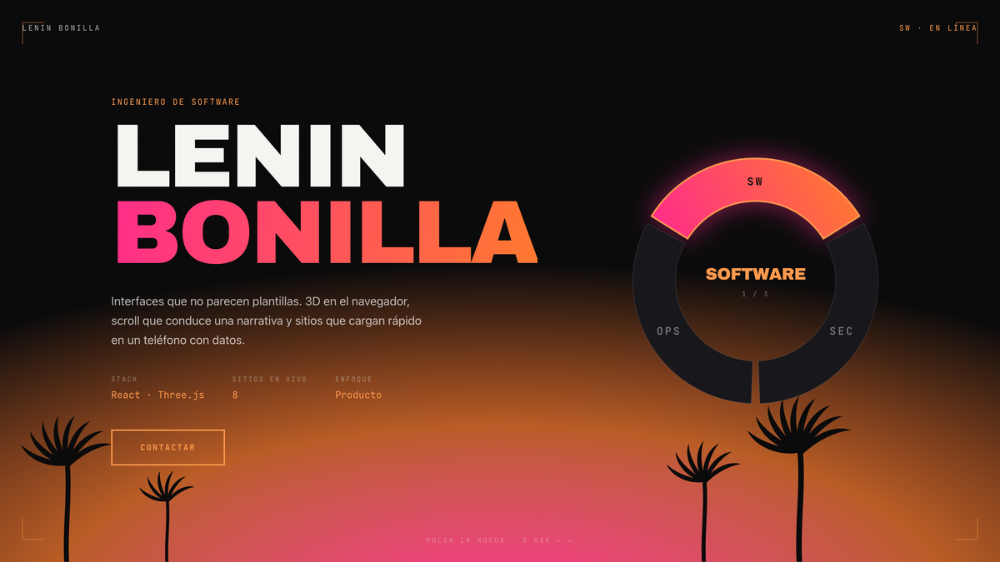
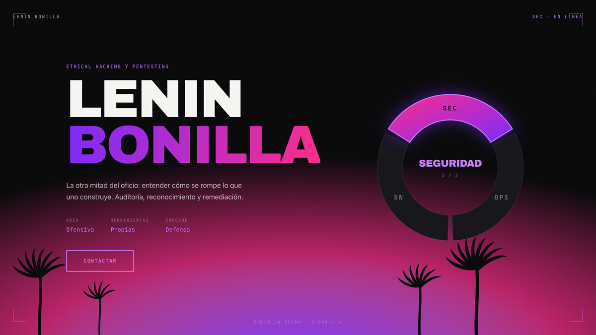
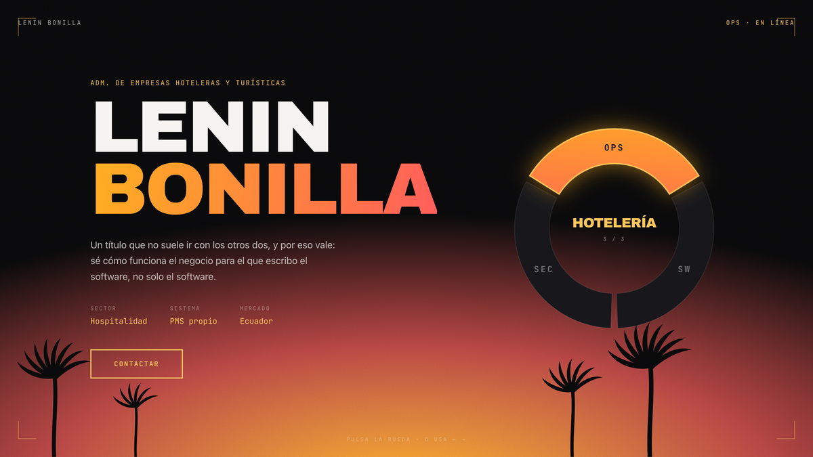

<div align="center">


<a href="https://fleremiasflemin20-maker.github.io/vice-portfolio/">
  
</a>

<br/><br/>


</div>

<br/>

<p align="center">
  
</p>

## Sobre el proyecto

Portfolio con el lenguaje visual de Vice City: atardecer de Miami, grano de película, palmeras en silueta y HUD de videojuego.

La pieza central es una **rueda de selección de personaje**. No es decoración del hero: **filtra la página entera**. Eliges faceta y cambian la paleta, el degradado del nombre, las cifras del HUD y los proyectos que se listan.

Nace de un problema real: hacer ingeniería de software, ciberseguridad y administración hotelera es una combinación rara. Escondida en tres pestañas iguales es ruido; convertida en el mecanismo central, es el argumento.

<table>
<tr>
<td width="33%"><br/><b>Software</b><br/>rosa → naranja</td>
<td width="33%"><br/><b>Seguridad</b><br/>púrpura → magenta</td>
<td width="33%"><br/><b>Hotelería</b><br/>dorado → coral</td>
</tr>
</table>

Los tres son el mismo atardecer mirado a distinta hora, no tres acentos sueltos.

## Decisiones

**SVG, no WebGL.** La rueda gira bajo control del usuario, que es el criterio habitual para sacar Three.js — pero el giro es de un anillo plano. En SVG queda nítido a cualquier resolución, pesa unos kilobytes y funciona aunque el WebGL falle.

**Los sectores son `<button>` de verdad**, no `<path>` con `onClick`. Salen gratis el foco, el teclado y la lectura por voz.

**La paleta viaja por variables CSS**, no por props: un solo sitio que escribir y un solo sitio donde mirar cuando algo no cambia.

**Sin marca de Rockstar.** Ni logo, ni tipografía, ni material del tráiler. Solo el lenguaje visual. Las palmeras están dibujadas a mano en SVG — dos curvas para el tronco, porque una palmera nunca es recta.

## Notas de implementación

Tres cosas que costaron encontrar:

**GSAP no escribía la rotación** en el `<g>` del SVG, sin dar error. Se sustituyó por transición CSS, que además es determinista.

**El anillo se dibujaba 251 px por debajo del centro.** Era `transform-box: view-box`, que resuelve el origen desde la esquina del viewBox. Con `fill-box` el eje es el centro de la propia figura.

**Las etiquetas se torcían durante el giro**, porque su contragiro saltaba al valor final mientras el anillo tardaba 0,7 s. Ahora comparten duración y curva.

## Ver el código localmente

```bash
git clone https://github.com/fleremiasflemin20-maker/vice-portfolio.git
cd vice-portfolio
npm install
npm run dev
```

<br/>

<div align="center">

**Lenin Bonilla** · Ingeniero de software

<a href="https://www.linkedin.com/in/fleremahiaslenin">
  
</a>


</div>
